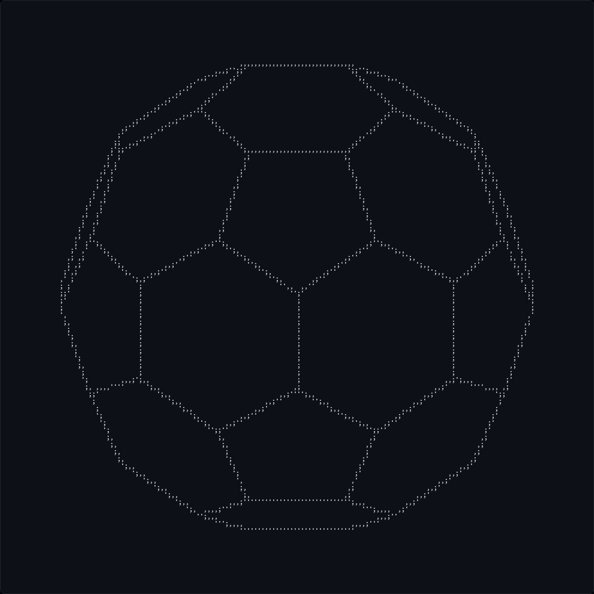
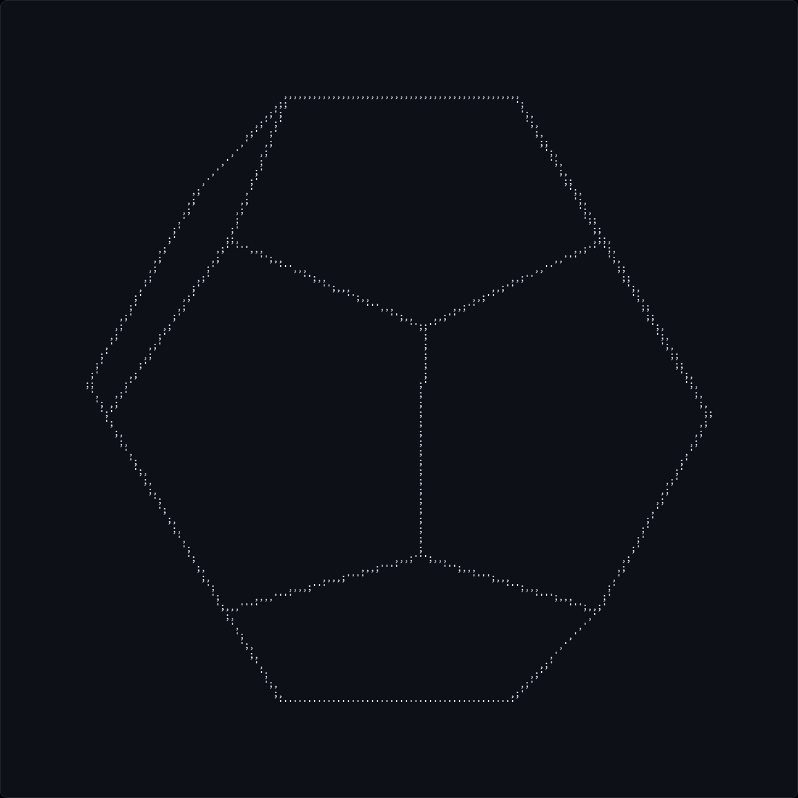
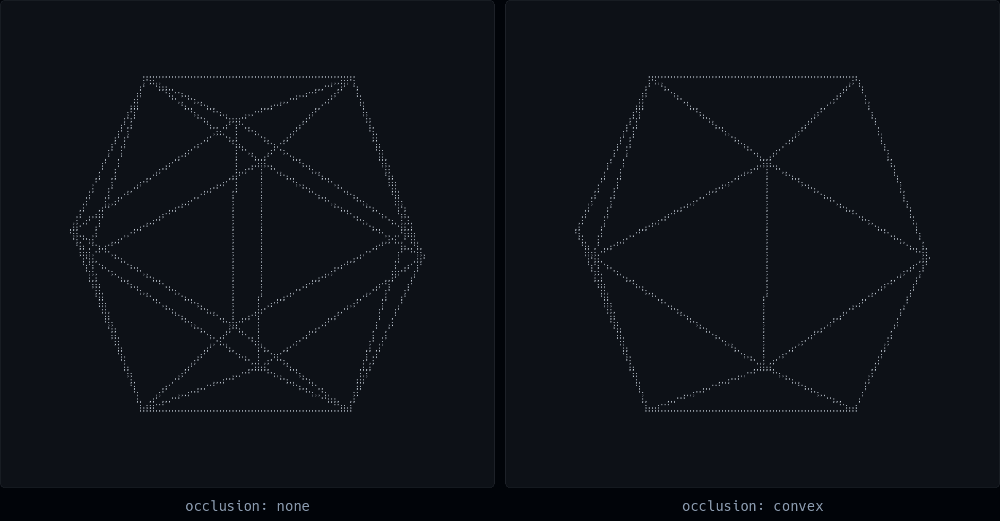

# Glyphedron

Polyhedra drawn in terminal glyphs.



Glyphedron reads a polyhedron from a plain text file, samples points along every
edge, and draws each one as `'`, `,` or `;` depending on where it lands inside a
character cell. You turn, move and scale the shape from the keyboard, and it can
remove the edges that the solid itself hides.

It is C11 and ncurses, and nothing else.

- [Build](#build)
- [Run](#run)
- [Controls](#controls)
- [How it draws](#how-it-draws)
- [Occlusion](#occlusion)
- [Shapes](#shapes)
- [Shape file format](#shape-file-format)
- [Tests](#tests)
- [Repository layout](#repository-layout)

## Build

You need `clang`, `make` and the ncurses development headers. The Makefile names
clang explicitly as both compiler and linker.

```sh
# Arch
sudo pacman -S clang make ncurses

# Debian and Ubuntu
sudo apt install clang make libncurses-dev

# macOS: clang and make come with the Xcode command line tools
brew install ncurses
```

Then:

```sh
make
```

That builds `build/bin/glyphedron` and leaves a `glyphedron` symlink in the
repository root.

| Target | What it does |
|---|---|
| `make` | the default build |
| `make debug_c` | the same, plus `-DDEBUG -g` |
| `make release_c` | the same, plus `-O3` |
| `make clean` | removes `build/`, the symlink and `log.txt` |

Objects are rebuilt when the flags change, not only when the sources do, so
switching between these targets does the right thing without a `clean` in
between.

## Run

```sh
./glyphedron                                          # the built-in cube
./glyphedron shapes/platonic_solids/icosahedron.txt   # any shape file
```

Run it from the repository root. With no argument the program loads
`./shapes/platonic_solids/cube.txt` by a relative path, so it will fail to start
from anywhere else. It also opens a `log.txt` in the working directory, which is
a stub that nothing writes to; `make clean` removes it.

Three lines print in the top left: the occlusion method in force and, from the
timing code that is compiled in by default, how long the last redraw and the
last keypress took. The pictures in this file were taken with that overlay
compiled out, so the shape has the screen to itself.

The shape is scaled to the terminal's **height**, on both axes, so it keeps its
proportions when the window is wide. A shape fits vertically when its
circumradius is at most 2.5, which every bundled solid but three satisfies.
Those three start off the edge of the screen and want a few presses of `-`:
three for the small stellated dodecahedron and the truncated tetrahedron, eight
for the truncated icosahedron.

## Controls

Every keypress redraws the shape.

| Key | Action |
|---|---|
| `q` | quit |
| `r` | reset the shape to its file |
| `t` / `y` | rotate about z, by ±π/200 |
| `u` / `i` | rotate about x, by ±π/200 |
| `p` / `o` | rotate about y, by ±π/200 |
| `h` / `l` | translate along x, by ∓0.1 |
| `j` / `k` | translate along y, by ∓0.1 |
| `f` / `g` | translate along z, by ∓0.1 |
| `-` / `=` | scale by 1/1.1 or 1.1 |
| `9` / `0` | fewer or more sample points per edge |
| `1` | toggle the vertex indices |
| `2` | toggle the edges |
| `3` | cycle the occlusion method |
| `a` | autorotate |

`a` asks whether you want automatic rotation or a hand-entered one. Press `a`
again for the default tumble of π/80, π/120 and π/60 radians per frame about x,
y and z, redrawn every 60 ms, or `m` to type the three angles yourself. Either
way, `a` stops it.

Turning the vertex indices on with `1` labels each vertex with its position in
the file, which is what makes writing the edge and face lines of a new shape
bearable.

## How it draws



A terminal cell is about twice as tall as it is wide, so glyphedron treats each
one as two square pixels stacked vertically and picks the glyph that says which
halves are lit:

| Glyph | Meaning |
|---|---|
| `'` | upper half |
| `,` | lower half |
| `;` | both halves |

Drawing an edge means walking it. Each edge is cut into `e_density` equal steps,
50 by default, and every point along it is projected on its own; the straight
lines you see are a consequence, not a primitive. `9` and `0` change the step
count. Raising it fills the gaps in near-diagonal edges, and costs a
proportional amount of work.

The projection itself is orthographic: `x` and `y` scale to the window and `z`
is discarded. Depth enters only through occlusion, which casts rays toward a
centre of projection at `{0, 0, 10000}`.

Two points that would land in the same half of the same cell are collapsed to
one. A cell that receives both of its halves is promoted from `'` or `,` to `;`.
Visible points are drawn bold and hidden ones dim, so a shape rendered with
`convex_clear` reads as two layers.

## Occlusion

Press `3` to cycle through the methods. The current one is named at the top of
the screen.



| Mode | What it does |
|---|---|
| `none` | draws every sampled point |
| `approximate` | drops a point when the angle between "point to centre of the solid" and "point to eye" is under π/3. Cheap and crude: the cutoff is a fixed cone, so it does not follow the silhouette |
| `convex` | casts a ray from the point to the eye against every face, and does not draw the point if a face blocks it |
| `convex_clear` | the same test, but hidden points are drawn dim rather than dropped |
| `exact not implemented` | a placeholder; behaves like `none` |

Occlusion needs faces. A file that declares zero faces still draws, but nothing
in it will ever be hidden.

`convex` is the interesting one, and it is what every picture in this file uses.
Measured against an independent ray caster it is exact on the icosahedron above,
and on the cube.

It is also named for its assumption, and every solid pictured here is convex on
purpose. Point it at one that is not — the small stellated dodecahedron is the
bundled example — and it hides slightly more than it should, because "a face is
in front of me" stops meaning "I am hidden". Rays that pass exactly through a
vertex have no stable answer either. What was measured, how much it actually
costs, and what a real fix would take are written up in
[docs/occlusion.md](docs/occlusion.md).

## Shapes

Twelve shapes ship in `shapes/`.

| Directory | Files |
|---|---|
| `platonic_solids/` | tetrahedron, cube, octahedron, dodecahedron, icosahedron |
| `archimedean_solids/` | truncated tetrahedron, cuboctahedron, truncated cube, truncated octahedron, truncated icosahedron |
| `kepler_poinsot_polyhedra/` | small stellated dodecahedron |
| `miscellaneous/` | `S.txt`, a flat letter S with no faces |

## Shape file format

A shape file is three blocks of comma separated numbers, preceded by a line
saying how long each block is. Blank lines between blocks are ignored.

```
n, m, k        number of vertices, edges and faces

n lines        x, y, z        the position of a vertex
m lines        i, j           the two vertex indices making an edge
k lines        i, j, k, ...   the vertex indices around one face
```

Vertices are indexed from zero in the order they appear. Each edge needs to be
listed only once. A face's indices must go around its perimeter in order, along
its edges, or the face will not describe the polygon you meant.

Face lines accept commas, spaces or both as separators.

Here is the whole cube:

```
8, 12, 6

1, 1, 1
-1, 1, 1
1, -1, 1
-1, -1, 1
1, 1, -1
-1, 1, -1
1, -1, -1
-1, -1, -1

0, 1
0, 2
0, 4
1, 3
1, 5
2, 3
2, 6
3, 7
4, 5
4, 6
5, 7
6, 7

0, 2, 6, 4
0, 4, 5, 1
0, 1, 3, 2
1, 5, 7, 3
2, 3, 7, 6
4, 6, 7, 5
```

Either of the last two blocks may be empty, as long as the first line says `0`.
Zero faces means no occlusion. Zero edges means the vertices are drawn by index
instead, which is how `S.txt` works.

An index that does not name a vertex the file declared is an error and the load
fails. The counts on the first line are otherwise trusted: over 10240 they warn
and carry on, and a face line is read 2048 bytes at a time.

## Tests

```sh
make test
make test-asan
```

`make test` runs the suite against a plain build. `make test-asan` rebuilds it
under AddressSanitizer and UBSan into a separate object tree and runs the same
suite.

Run both. They are not interchangeable: the coverage for `init_from_file`'s
cleanup path detects a bad free, which a plain build usually performs in
silence. Only the sanitiser build fails on it.

```
vector       21/21
occlusion    109/109
raster       16/16
init         8/8

OK: 154 passed, 0 failed
```

The tests link just the modules that need neither ncurses nor `main()`, so they
need no terminal. Run them from the repository root, since the fixtures under
`tests/fixtures` are opened by relative path.

Both targets, plus a plain `make` so that `-Werror` covers the ncurses-only
modules too, run on every push to `main` and every pull request. See
[.forgejo/workflows/tests.yml](.forgejo/workflows/tests.yml).

## Repository layout

```
src/c/include/   headers
src/c/src/       implementation
src/c/tests/     the test suite and its harness
tests/fixtures/  malformed shape files the loader is tested against
shapes/          shape files, grouped by family
docs/            occlusion.md
images/          the pictures in this file
```

The modules split along one line: `vector`, `raster`, `occlusion`,
`convex_occlusion`, `occlude_approx` and `init` need neither ncurses nor
`main()`, and are what the tests link. `print`, `transform`, `timing` and
`glyphedron` are the rest.

## Licence

GPL-3.0-or-later. See [LICENSE](LICENSE).
